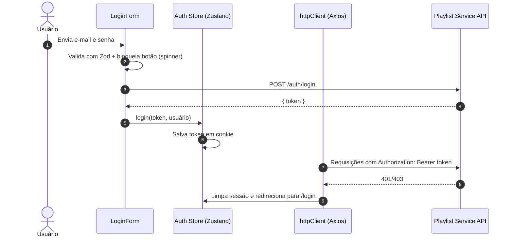
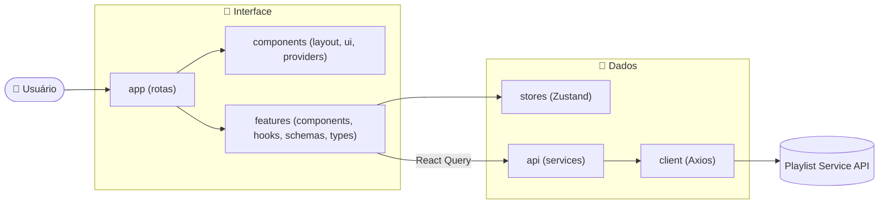

<div align="center">

# 🎵 Playlist Service — Front-end

**Interface web para gerenciamento de Playlists e Músicas, integrada à Playlist Service API.**

Construída com Next.js (App Router), React Query, Zustand e arquitetura orientada a features.

<br/>


<br/><br/>


<br/><br/>

[Funcionalidades](#-funcionalidades) •
[Telas](#-telas-e-rotas) •
[Arquitetura](#️-arquitetura) •
[Integração com a API](#-integração-com-a-api) •
[Como Executar](#️-como-executar) •
[Contato](#-autor-e-contato)

</div>

---

## 📌 Sobre o Projeto

O **Playlist Service Front-end** é a interface do usuário para criar, consultar e organizar **playlists** e **músicas**. Ele consome a [Playlist Service API](https://github.com/Cloves-Neto/back-playlist-service), autenticada com **JWT**.

O foco do projeto é **organização e experiência de uso**: código dividido por features, camada de API isolada, validação de formulários com schemas e estado de servidor gerenciado pelo React Query.

> [!NOTE]
> O back-end usa **H2 em memória**. Ao reiniciar a API, os dados (e o usuário) são apagados. Será necessário se registrar novamente.

---

## 🚀 Funcionalidades

<table>
  <tr>
    <th align="center">🔐 Autenticação</th>
    <th align="center">📂 Playlists</th>
    <th align="center">🎶 Músicas</th>
  </tr>
  <tr valign="top">
    <td>
      ✅ Cadastro de usuário<br/>
      ✅ Login com JWT<br/>
      ✅ Botão com loading e bloqueio de envios duplicados<br/>
      ✅ Logout com limpeza total (storage, cookies e cache)<br/>
      ✅ Redirecionamento automático em 401/403
    </td>
    <td>
      ✅ Criar playlist (com músicas)<br/>
      ✅ Listar playlists<br/>
      ✅ Ver detalhes da playlist<br/>
      ✅ Adicionar músicas existentes<br/>
      ✅ Remover músicas<br/>
      ✅ Excluir playlist
    </td>
    <td>
      ✅ Cadastrar música<br/>
      ✅ Buscar por título<br/>
      ✅ Editar música<br/>
      ✅ Excluir música
    </td>
  </tr>
</table>

---

## 🧭 Telas e Rotas

| Rota | Grupo | Descrição | Acesso |
| :--- | :---: | :--- | :---: |
| `/login` | `(auth)` | Tela de login | 🔓 |
| `/register` | `(auth)` | Tela de cadastro | 🔓 |
| `/` | `(workspace)` | Workspace com a listagem de playlists | 🔒 |
| `/playlists/[name]` | `(workspace)` | Detalhes da playlist e suas faixas | 🔒 |

> [!IMPORTANT]
> Rotas do grupo `(workspace)` exigem sessão ativa. Sem token válido, o usuário é redirecionado para `/login`.

### 🔄 Fluxo de autenticação



---

## 🛠️ Tecnologias e Dependências

<details>
<summary><b>Ver lista completa de dependências</b></summary>

<br/>

| Dependência | Para que serve |
| :--- | :--- |
| **Next.js 16** | Framework React com App Router |
| **React 19** | Biblioteca de interface |
| **TypeScript 5** | Tipagem estática |
| **Tailwind CSS 4** | Estilização utilitária |
| `@base-ui/react` + `shadcn` | Componentes de UI acessíveis (menus, diálogos etc.) |
| `@tanstack/react-query` | Cache, refetch e mutações do estado do servidor |
| `zustand` | Estado global (autenticação e workspace) |
| `axios` | Cliente HTTP com interceptors |
| `react-hook-form` + `@hookform/resolvers` | Gerenciamento de formulários |
| `zod` | Schemas de validação |
| `framer-motion` | Animações |
| `lucide-react` | Ícones |
| `sonner` | Notificações (toasts) |
| `eslint` | Padronização de código |

</details>

---

## 🏗️ Arquitetura

### Visão em camadas



<details>
<summary><b>📣 Feature-based Architecture</b></summary>

<br/>

O código é agrupado **por domínio**, e não por tipo de arquivo. Cada feature (`auth`, `playlist`, `music`) concentra seus próprios componentes, hooks, schemas e tipos. Isso deixa claro o que o sistema faz e facilita a manutenção.

</details>

<details>
<summary><b>🔌 Camada de API (um serviço por ação)</b></summary>

<br/>

Em `src/api`, cada operação do back-end possui sua própria pasta e classe de serviço (ex.: `lists/add-musics/services/AddMusicsToPlaylistService`). Os componentes **nunca** chamam o Axios diretamente: eles usam hooks do React Query que, por sua vez, delegam para esses serviços.

</details>

<details>
<summary><b>📁 Estrutura de pastas</b></summary>

<br/>

```text
src
├── api                     → Serviços HTTP (um por ação do back-end)
│   ├── client              → httpClient (Axios + interceptors)
│   ├── auth                → login, register
│   ├── lists               → create, get-all, get-by-name, add-musics,
│   │                         remove-musics, delete
│   └── musics              → create, search, edit, delete
├── app                     → Rotas (App Router)
│   ├── (auth)              → login, register
│   └── (workspace)         → home e playlists/[name]
├── components
│   ├── layout              → Header, UserProfileMenu...
│   ├── providers           → React Query, tema etc.
│   └── ui                  → Componentes base (button, input, dropdown...)
├── features
│   ├── auth                → components, schemas, types
│   ├── playlist            → components, hooks, schemas, types
│   └── music               → components, hooks, schemas, types
├── hooks                   → Hooks compartilhados
├── lib                     → Utilitários
└── stores                  → auth.store, workspace.store (Zustand)
```

</details>

<details>
<summary><b>🧠 Gerenciamento de estado</b></summary>

<br/>

| Tipo | Ferramenta | Uso |
| :--- | :--- | :--- |
| Estado do servidor | React Query | Playlists e músicas (cache, refetch ao montar, invalidação após mutações) |
| Estado global do cliente | Zustand | Sessão do usuário e preferências do workspace |
| Estado de formulário | React Hook Form + Zod | Validação e envio de dados |

> [!TIP]
> Após adicionar ou remover músicas, as queries da playlist são invalidadas. A tela de detalhes também faz refetch ao montar, garantindo dados sempre atualizados.

</details>

---

## 🔗 Integração com a API

O front consome a [Playlist Service API](https://github.com/Cloves-Neto/back-playlist-service) por meio do `httpClient`, que:

- Usa `NEXT_PUBLIC_API_URL` como base (padrão: `http://localhost:8080`);
- Anexa o header `Authorization: Bearer <token>` automaticamente;
- Em respostas `401/403`, limpa a sessão e redireciona para `/login`.

| Recurso | Endpoints utilizados |
| :--- | :--- |
| 🔐 Auth | `POST /auth/register`, `POST /auth/login` |
| 📂 Playlists | `POST /lists`, `GET /lists`, `GET /lists/{name}`, `POST /lists/{name}/musics`, `DELETE /lists/{name}/musics`, `DELETE /lists/{name}` |
| 🎶 Músicas | `POST /musics`, `GET /musics/search?nome=`, `PUT /musics/{id}`, `DELETE /musics/{id}` |

> [!NOTE]
> A resposta da API de playlists expõe as faixas como `musics` e `musicas`. O front normaliza ambos os formatos com a função `normalizePlaylist`.

---

## ⚙️ Como Executar

### 📋 Pré-requisitos

| Ferramenta | Obrigatório | Observação |
| :--- | :---: | :--- |
| [Git](https://git-scm.com) | ✅ | Para clonar o repositório |
| [Node.js 20+](https://nodejs.org/) | ✅ | Para rodar o Next.js |
| [npm](https://www.npmjs.com/) | ✅ | Gerenciador de pacotes (vem com o Node) |
| [Back-end](https://github.com/Cloves-Neto/back-playlist-service) | ✅ | A API precisa estar rodando em `localhost:8080` |

> [!TIP]
> Confira a versão do Node com `node -v`.

### 1️⃣ Subir o back-end

Siga o README do [back-playlist-service](https://github.com/Cloves-Neto/back-playlist-service) e rode:

```cmd
.\mvnw.cmd spring-boot:run
```

### 2️⃣ Clonar o repositório

```bash
git clone https://github.com/Cloves-Neto/app-playlist-service.git
cd app-playlist-service
```

### 3️⃣ Instalar as dependências

```bash
npm install
```

### 4️⃣ Configurar variáveis de ambiente (opcional)

Crie um arquivo `.env.local` na raiz caso a API não esteja em `localhost:8080`:

```env
NEXT_PUBLIC_API_URL=http://localhost:8080
```

### 5️⃣ Rodar em desenvolvimento

```bash
npm run dev
```

A aplicação abre em **`http://localhost:3000`**.

### 6️⃣ Outros comandos

| Comando | Descrição |
| :--- | :--- |
| `npm run dev` | Servidor de desenvolvimento |
| `npm run build` | Build de produção |
| `npm run start` | Executa o build de produção |
| `npm run lint` | Verifica o código com ESLint |

### 7️⃣ Primeiro acesso

1. Acesse `http://localhost:3000/register` e crie sua conta.
2. Faça login em `/login`.
3. Crie uma playlist e adicione músicas.

> [!IMPORTANT]
> Para popular a API rapidamente com músicas e playlists, use a coleção do Postman disponível no repositório do back-end (`docs/Playlist_Service.postman_collection.json`).

---

## 📫 Autor e Contato

<div align="center">

[](https://devneto.com.br)
[](https://www.linkedin.com/in/cloves-neto)
[](https://wa.me/5511967338685)
[](mailto:cvr.neo20@gmail.com)

</div>
